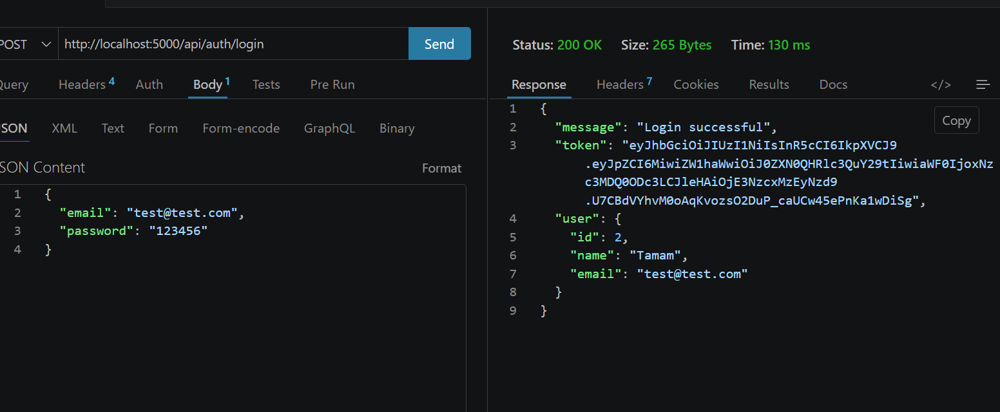
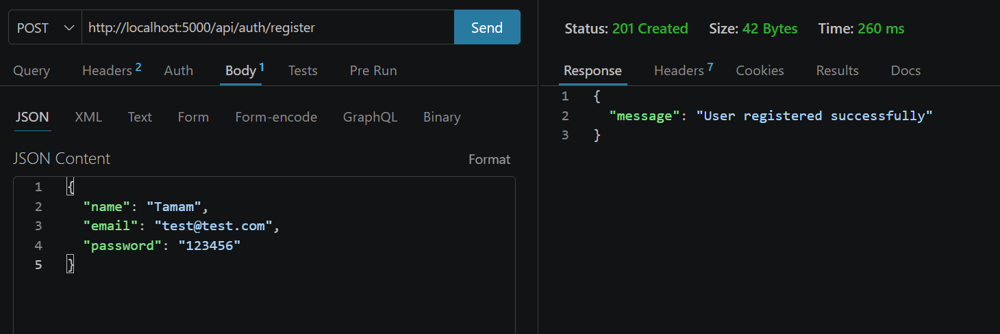
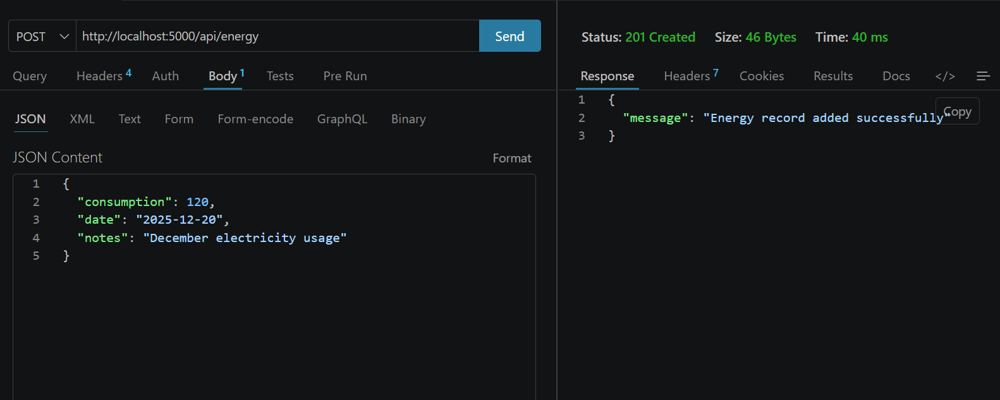
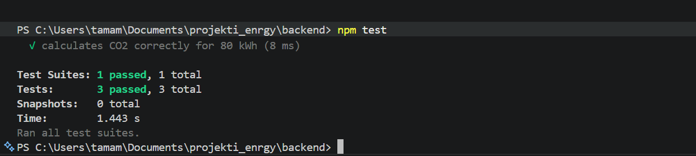

# Eco Energy Tracker

## Projektin Yleiskuvaus

Eco Energy Tracker on full stack -verkkosovellus, jonka avulla käyttäjät voivat seurata sähkönkulutustaan, ymmärtää ympäristövaikutuksia (CO2) ja arvioida kuukausittaista sähkölaskuaan.

Järjestelmä mahdollistaa myös sähkölaskujen lataamisen, tietojen visualisoinnin kaavioilla sekä älykkäiden energiansäästövinkkien saamisen.

---

## 🎯 Kohderyhmä

- Opiskelijat ja nuoret aikuiset
- Kotitaloudet, jotka hallitsevat sähkökustannuksia
- Käyttäjät, jotka haluavat vähentää energiankulutusta

---

## Käytetyt Teknologiat

### Frontend
- React.js (SPA)
- Chart.js
- jsPDF (laskujen luontiin)

### Backend
- Node.js
- Express.js (REST API)

### Tietokanta
- MariaDB

### Muut työkalut
- JWT-autentikointi
- Multer (tiedostojen lataus)
- Ulkoinen API (sähkön hinta – Suomi)

---

## Ominaisuudet

### Käyttäjähallinta *
- Rekisteröityminen ja kirjautuminen
- JWT-autentikointi
- Suojatut reitit

### Energiankulutuksen seuranta *
- Lisää, muokkaa, poista kulutustietoja
- Näe kokonaiskulutus
- CO2-laskenta

### Datan visualisointi *
- Pylväsdiagrammi energiankulutuksesta
- Ympyrädiagrammi huippu- ja hiljaisista ajoista
- Tietueiden vertailu

### Tiedostojen lataus *
- Lataa sähkölaskuja
- Näe ladatut tiedostot

### Laskutusjärjestelmä
- Automaattinen kuukausilaskun laskenta
- Sähkön hinnan integrointi
- Lataa lasku PDF-muodossa
- Laskun numero, yrityksen nimi, eräpäivä

### Ylläpitäjän hallintapaneeli
- Näe kaikki käyttäjät
- Näe kaikki energiankulutustiedot
- Roolipohjainen käyttöoikeus

---

## Tietokantarakenne

### Käyttäjät-taulu
- id
- nimi
- sähköposti
- salasana
- rooli

### Energiatiedot
- id
- user_id
- kulutus
- päivämäärä
- muistiinpanot

### Tiedostot
- id
- user_id
- tiedostopolku
- alkuperäinen_nimi
- mimetype

---

## Testaus

### Yksikkötestaus
- CO2-laskenta testattu Jestillä

### API-testaus
- Kirjautumisrajapinta testattu Supertestillä

### Käytettävyystestaus
- Testattu kolmella oikealla käyttäjällä
- Käyttäjät suorittivat onnistuneesti:
  - Kirjautuminen
  - Energiatietojen lisääminen
  - Kaavioiden tarkastelu
  - Tiedostojen lataus

//kuvat test
<p align="center">
  
</p>
<p align="center">
  
</p>
<p align="center">
  
</p>
<p align="center">
  
</p>
<p align="center">
  
</p>
<p align="center">
  
</p>
<p align="center">
  
</p>

---

## Ohjelmistoarkkitehtuuri

- Frontend kommunikoi backendin kanssa REST API:n kautta
- Backend yhdistyy MariaDB-tietokantaan
- Ulkoinen API käytössä sähkön todellisiin hintoihin

---

## Kuinka projekti käynnistetään

### 1. Backendin käynnistys

```bash
cd backend
npm install
npm start
```
- Käynnistää palvelimen oletusporttiin (yleensä 5000 tai asetusten mukaan).
- Varmista, että tietokanta (MariaDB) on asennettu ja yhteystiedot päivitetty tiedostoon backend/database.js.

### 2. Frontendin käynnistys

```bash
cd frontend
npm install
npm start
```
- Avaa sovelluksen selaimessa osoitteessa: http://localhost:3000

### 3. Testien suoritus

#### Backend-testit (Jest & Supertest)

```bash
cd backend
npm test
```

#### Frontend-testit (jos olemassa)

```bash
cd frontend
npm test
```

