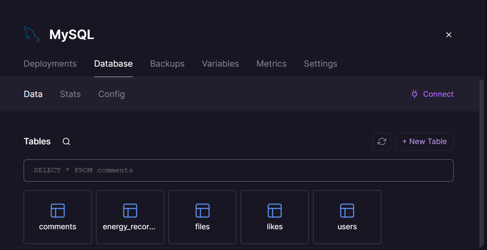
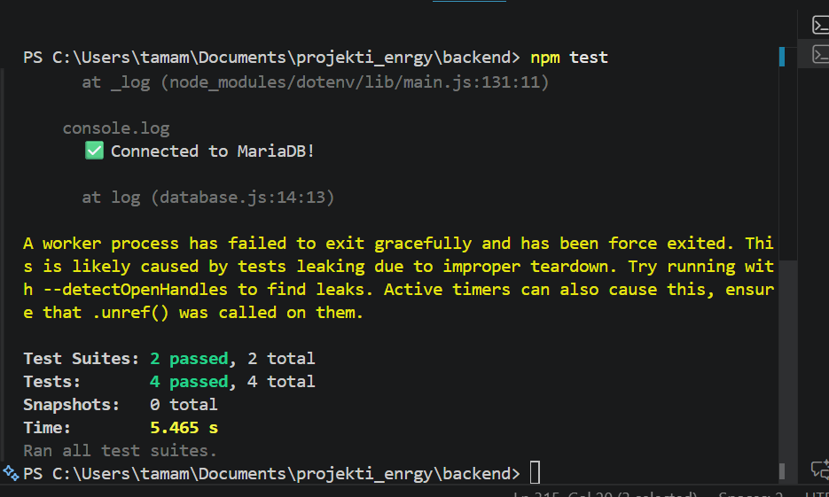
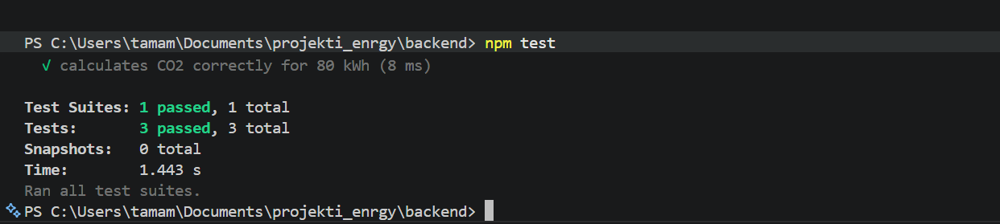

# Projekti Enrgy 

##  Demo
Frontend: https://tk-web.netlify.app  
Backend API: https://energia-web-1.onrender.com  

---

##  GitHub Repos

Frontend: https://github.com/Tamamkarim/energia_web  
Backend: https://github.com/Tamamkarim/energia_web  

---

##  Testikäyttäjät

### User
- email: test@test.com
- password: 123456

### User 2
- email: tamam@test.com
- password: 123456

---

##  Kuvakaappaukset

### Tietokanta

### Login API test

### Testit

---

##  Sovelluksen kuvaus

Projekti Enrgy on energian kulutuksen seurantajärjestelmä, jossa käyttäjät voivat:
- kirjautua sisään
- seurata energiankulutusta
- tallentaa tiedostoja
- käyttää reaaliaikaista dataa

---

##  Teknologiat

### Backend
- Node.js
- Express
- MariaDB / SQLite
- JWT Auth
- Multer + Cloudinary
- Socket.io

### Frontend
- React (Vite)
- Socket.io-client

---

##  Tietokanta

Taulut:
- users
- comments
- files
- likes
- energy_records

 Lisää ER-kaavio kuva tähän

---

##  API Dokumentaatio

Lisää:
https://energia-web-1.onrender.com/apidoc

(TAI Postman / Swagger linkki)

---

##  Toiminnallisuudet

- ✅ Rekisteröinti
- ✅ Kirjautuminen (JWT)
- ✅ Energian seuranta
- ✅ Admin-toiminnot (jos on)
- ✅ Tiedoston upload
- ✅ Reaaliaikaisuus (Socket.io)
- ✅ Testit (Jest)

---

## Testaus

Testit löytyvät:

---

# MITÄ SINUN PITÄÄ TEHDÄ VIELÄ

✔ Lisää GitHub-linkit  
✔ Lisää kuvat `/screenshots` kansioon  
✔ Lisää API docs linkki  
✔ Tee repo public  

---

Jos haluat, voin:
- tarkistaa sun GitHubin linkit
- tehdä ER-kaavion
- korjata test warningin

 Laita repo linkki tänne.