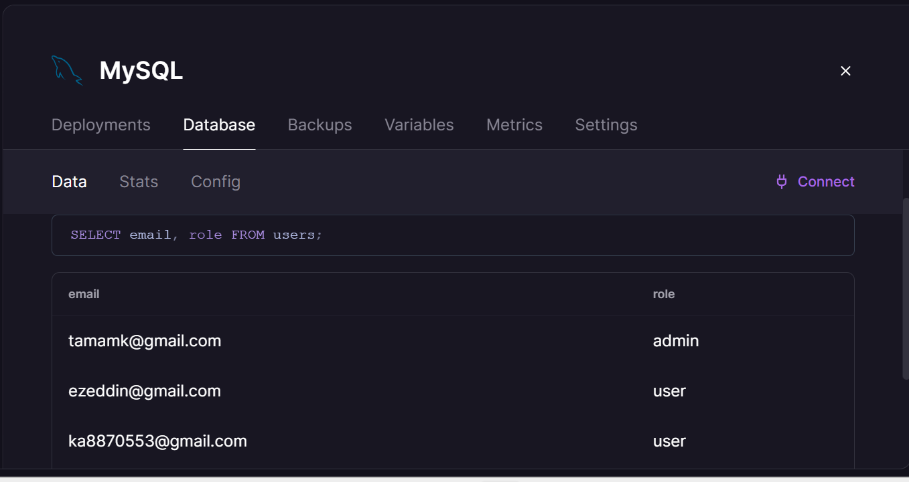
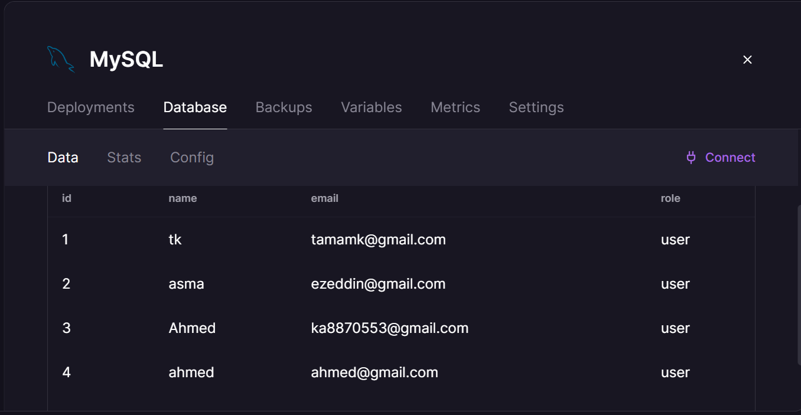

# Projekti Enrgy – Energiahallintajärjestelmä

Tämä on järjestelmä energiatietojen hallintaan ja analysointiin. Se koostuu kahdesta pääosasta:

## 1. Taustajärjestelmä (Backend)

- Rakennettu käyttäen Node.js ja Express.
- Tarjoaa ohjelmointirajapintoja (API) käyttäjien hallintaan, kirjautumiseen ja rekisteröitymiseen, energiatietojen hallintaan, tiedostojen lataamiseen ja hinnanhallintaan.
- Yhdistyy tietokantaan MySQL tietojen tallentamista varten.
- Sisältää middleware-komponentteja käyttöoikeuksien tarkistamiseen sekä controller-moduuleja sovelluslogiikan organisointiin.

### Käytetyt teknologiat (Backend)
- Node.js
- Express.js
- MariaDB railway
- JWT Auth
- Multer + Cloudinary
- Socket.io

## 2. Käyttöliittymä (Frontend)

- Ohjelmointikieli: JavaScript ja TypeScript
- Kehys: React.js (Vite)
- Paketinhallinta: npm
- Rakennustyökalu: Vite
- Tyylit ja ulkoasu: CSS
- Socket.io-client

---

## Demo
Frontend: https://tk-web.netlify.app  
Backend API: https://energia-web-1.onrender.com  

## GitHub Repos
Frontend: https://github.com/Tamamkarim/energia_web  
Backend: https://github.com/Tamamkarim/energia_web  

## Testikäyttäjät

Admin
tamamk@gmail.com
1988218

---

## Projektin tavoite

Helpottaa energiatietojen hallintaa ja analysointia sekä tarjota keskitetty alusta käyttäjille ja ylläpitäjille energian kulutuksen, hintojen ja siihen liittyvien raporttien seurantaan.

## Miten projekti toimii?

1. Käyttäjä rekisteröityy tai kirjautuu sisään käyttöliittymän kautta.
2. Käyttöliittymä lähettää pyyntöjä palvelimelle REST API:n kautta.
3. Palvelin käsittelee pyynnöt (esim. energiatietojen lisääminen, tiedoston lataus jne.) ja tarkistaa käyttöoikeudet.
4. Tiedot tallennetaan tietokantaan tai palautetaan käyttöliittymälle.
5. Käyttöliittymä näyttää tiedot käyttäjälle interaktiivisesti.

## Projektin rakenne

- **backend/**: sisältää palvelinkoodin (server.js), tietokantamallit, controllerit, reitit ja middlewaret
- **frontend/**: sisältää käyttöliittymäkoodin, sivut, komponentit, palvelut ja asetustiedostot

---

## Sovelluksen keskeiset toiminnot

- Käyttäjien rekisteröinti ja kirjautuminen (roolit: ylläpitäjä/käyttäjä)
- Energian kulutuksen seuranta ja analysointi
- Tiedostojen lataus ja hallinta
- Hintatietojen hallinta
- Reaaliaikainen data (Socket.io)
- Admin-toiminnot (jos käyttäjä on ylläpitäjä)
- Testit (Jest)

---

## Kuvakaappaukset

### Tietokanta

### Login API test

### Testit

### QR-koodi

---

## Tietokanta

Taulut:
- users
- comments
- files
- likes
- energy_records

Lisää ER-kaavio kuva tähän

---

## API Dokumentaatio

Lisää: https://energia-web-1.onrender.com

---

## Toiminnallisuudet

- Rekisteröinti
- Kirjautuminen (JWT)
- Energian seuranta
- Tiedoston upload
- Reaaliaikaisuus (Socket.io)
- Testit (Jest)

